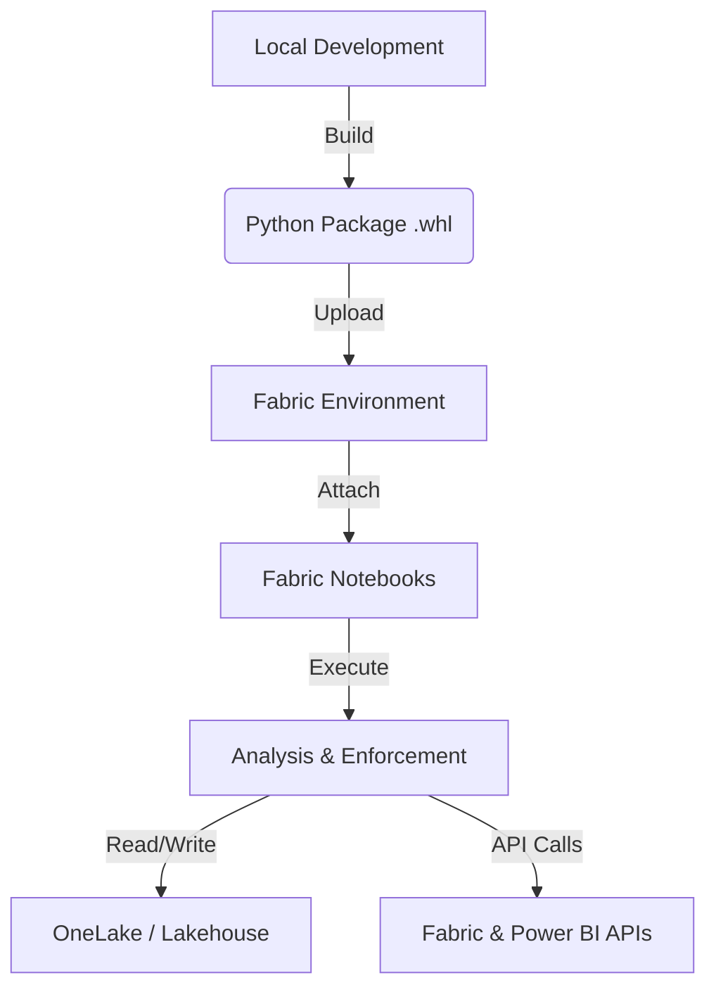

# Microsoft Fabric Monitoring System - Project Wiki

## 📖 Project Overview
The **USF Fabric Monitoring System** is a Python-based governance and observability solution designed for Microsoft Fabric. It provides deep visibility into tenant activities, enforces security policies, and generates actionable insights for platform administrators.

Unlike traditional scripts, this project is architected as a **deployable Python package** (`usf_fabric_monitoring`) that runs natively within Microsoft Fabric Environments, ensuring version control, consistency, and ease of use.

---

## 🏗️ Architecture
The solution moves away from "copy-pasting code into notebooks" and adopts a modern **Library-based Architecture**.



### Key Components
1.  **`usf_fabric_monitoring` Package**: The core logic (API wrappers, analysis engines, reporters) bundled as a library.
2.  **Fabric Environment**: A managed runtime where the package and dependencies (pandas, azure-identity) are installed.
3.  **Thin Notebooks**: Minimalistic notebooks that simply import the library and run a pipeline.
4.  **Configuration**: Secrets managed via `.env` files in OneLake or Azure Key Vault.

---

## 🚀 Deployment Guide (How We Made It Work)

### Phase 1: Build the Package
We transformed the local scripts into a distributable format.
1.  Navigate to the project root.
2.  Run the build command:
    ```bash
    pip install build
    python -m build
    ```
3.  This generates a `.whl` file in the `dist/` folder (e.g., `usf_fabric_monitoring-0.2.0-py3-none-any.whl`).

### Phase 2: Configure Fabric Environment
1.  In your Fabric Workspace, create a new **Environment** (e.g., `Monitoring_Env`).
2.  **Public Libraries**: Add `azure-identity`, `pandas`, `requests`, `python-dotenv` (and `jsonschema` if you want to run config validation in-notebook).
3.  **Custom Libraries**: Upload the `.whl` file generated in Phase 1.
4.  **Publish** the environment.

### Phase 3: Deploy Notebooks
1.  Import the notebooks from the `notebooks/` folder into your Fabric Workspace:
    *   `Monitor_Hub_Analysis.ipynb`
    *   `Workspace_Access_Enforcement.ipynb`
2.  Open each notebook and **Attach the Environment** created in Phase 2.

---

## ⚙️ Configuration & Secrets

The system requires a Service Principal to authenticate with Microsoft Fabric APIs.

### Required Variables
| Variable | Description |
| :--- | :--- |
| `AZURE_CLIENT_ID` | The Application ID of your Service Principal. |
| `AZURE_CLIENT_SECRET` | The Client Secret for authentication. |
| `AZURE_TENANT_ID` | Your Azure Tenant ID. |

Legacy aliases (supported): `CLIENT_ID`, `CLIENT_SECRET`, `TENANT_ID`.

### How to Configure in Fabric
**Option 1: Lakehouse .env (Recommended for Speed)**
1.  Create a file named `.env` locally with the variables above.
2.  Upload it to your Lakehouse in the **Files** section (`/lakehouse/default/Files/.env`).
3.  The notebooks are pre-configured to load this file.

**Option 2: Azure Key Vault (Recommended for Security)**
1.  Store secrets in Azure Key Vault.
2.  Configure a Cloud Connection in Fabric.
3.  Uncomment the Key Vault section in the notebook headers.

---

## 📘 Notebook Usage Guide

### 1. Monitor Hub Analysis (`Monitor_Hub_Analysis.ipynb`)
**Goal**: Extract recent history (default 7 days; capped at 28 days by API limits), analyze trends, and find failures.
*   **Input**: None (uses API).
*   **Output**: CSV Reports saved to `/lakehouse/default/Files/exports/monitor_hub_analysis/`.
*   **Key Reports**:
    *   `activities_master.csv`: Raw log of every event.
    *   `failure_analysis.csv`: Top failing items and errors.
    *   `user_performance.csv`: Most active users and their success rates.

**Defaults & Limits** (override via `.env`):
- `DEFAULT_ANALYSIS_DAYS` (default `7`)
- `MAX_HISTORICAL_DAYS` (default `28`)
- `EXPORT_DIRECTORY` (default `exports/monitor_hub_analysis`)

### 2. Workspace Access Enforcement (`Workspace_Access_Enforcement.ipynb`)
**Goal**: Ensure specific security groups (e.g., "Fabric Admins") are Admins on *every* workspace.
*   **Modes**:
    *   `assess`: Dry-run. Lists who is non-compliant.
    *   `enforce`: Actively adds the Service Principal/Group to workspaces.
*   **Why run this?**: If you see **401 Unauthorized** errors in the Analysis pipeline, run this in `enforce` mode to grant your Service Principal the necessary permissions to scan those workspaces.

---

## 🔧 Troubleshooting

### "No matching distribution found for usf_fabric_monitoring"
*   **Cause**: The notebook is trying to `pip install` a package that doesn't exist on the public internet.
*   **Fix**: Remove the `%pip install` line. Ensure the **Environment** is attached to the notebook. The environment provides the package.

### Useful CLI entry points (local or Fabric terminals)
- `usf-monitor-hub --days 14 --member-only --output-dir exports/monitor_hub_analysis`
- `usf-enforce-access --help`
- `usf-validate-config`

### "401 Client Error: Unauthorized" during Analysis
*   **Cause**: The Service Principal can see *that* a workspace exists (Tenant Admin rights) but cannot see *inside* it (Workspace Member rights).
*   **Fix**:
    1.  Ignore it if you only need high-level stats.
    2.  Run `Workspace_Access_Enforcement.ipynb` in `enforce` mode to add the Service Principal as an Admin to those workspaces.

### "Bad Request" for Workspace ID `000000...`
*   **Cause**: This represents "My Workspace" (Personal Workspace). Service Principals cannot access personal workspaces of other users.
*   **Fix**: This is expected behavior and can be ignored.
